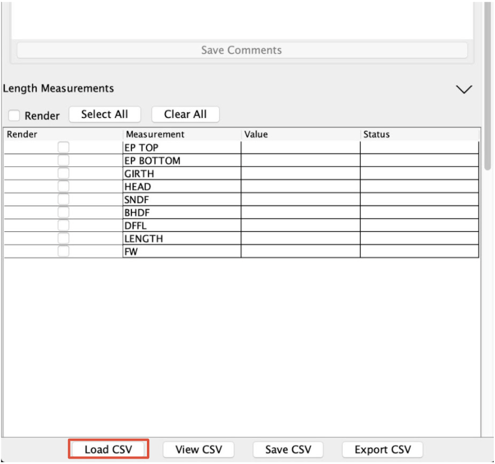
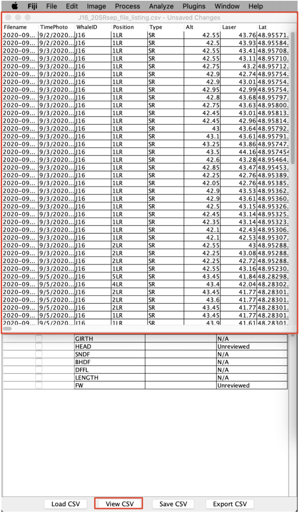
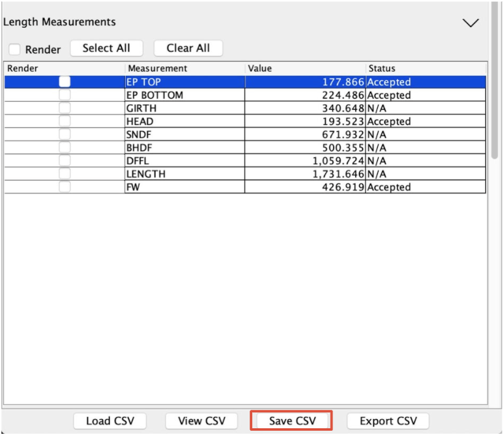
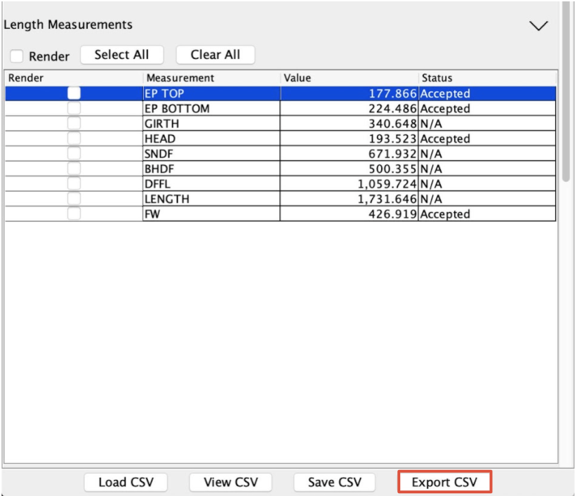

## Main CSV File
All data flows in and out of AMPT via a CSV file. The source CSV file must have at a minimum a column named 'Filename' which corresponds to the image filenames. Loading a a CSV file to start working with AMPT is not required as AMPT can create a correctly formatted file.

## Loading a CSV file

1. At the bottom of the AMPT Plugin panel, click Load CSV button.
1. Navigate to your desired CSV on your machine.
1. Click Open. You now have a working CSV

## View CSV

The View CSV button opens a window that displays the currently active data.

## Save CSV

The Save CSV button presents a dialog to allow the user to save the current data. The data saved by this option contains all the endpoints identified by user, as well as other metadata needed for AMPT's operation. This data supports the rendering of the measurements within AMPT, editing of previously recorded measurements, and may be used by other software.

## Export CSV

The Export CSV button presents a dialog to allow the user to save an extract of the current data. The data saved by this option contains only those columns identified as exportable in the [CSV-Columns.csv configuration file](csv_columns_config.md). This data supports the rendering of the measurements within AMPT, editing of previously recorded measurements, and may be used by other software.

